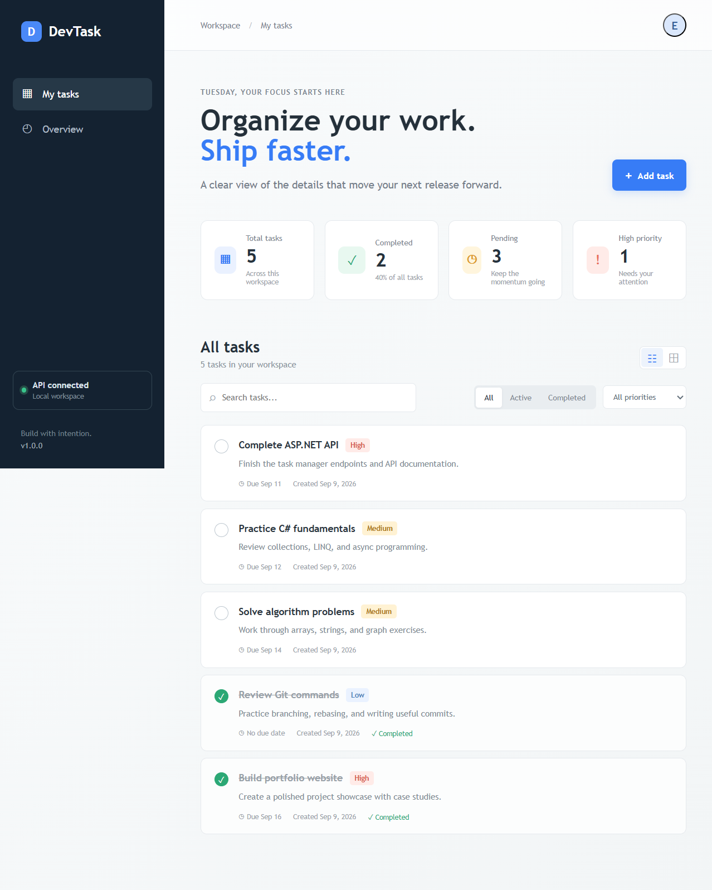

# DevTask

DevTask is a focused full-stack task manager for developers. It gives a small team or solo engineer a clear workspace for capturing work, prioritizing the next action, and keeping delivery moving.

## Features

- Responsive developer dashboard with task statistics
- Create, read, update, delete, and complete tasks
- Search by title and description
- Filter by status and priority
- High-priority, due-date, and completion indicators
- Seeded demo tasks for a useful first launch
- Accessible keyboard-friendly task modal
- Loading, empty, error, confirmation, and toast feedback states
- Swagger/OpenAPI documentation
- Configurable frontend API URL through `VITE_API_URL`
- Self-service account registration with validated email and hashed password storage

## Tech Stack

**Frontend:** TypeScript, Vite, HTML, CSS, vanilla TypeScript

**Backend:** C#, ASP.NET Core Web API, .NET 10

**Database:** SQLite, Entity Framework Core

## Architecture

```text
Frontend (Vite + TypeScript)
          |
          v
REST API (ASP.NET Core)
          |
          v
Service layer + Entity Framework Core
          |
          v
SQLite database
```

The frontend owns presentation state and communicates with the backend through `frontend/src/api/tasksApi.ts`. The backend owns validation, persistence, and business operations through the controller, service, and EF Core context.

## Project Structure

```text
backend/
  Controllers/TasksController.cs
  Data/DevTaskDbContext.cs
  Data/DbInitializer.cs
  Models/TaskItem.cs
  Models/TaskDtos.cs
  Services/ITaskService.cs
  Services/TaskService.cs
  Program.cs
frontend/
  src/api/tasksApi.ts
  src/types/task.ts
  src/utils/format.ts
  src/main.ts
  src/style.css
  index.html
```

## API Endpoints

| Method | Endpoint | Description |
| --- | --- | --- |
| GET | `/api/tasks` | List all tasks |
| GET | `/api/tasks/{id}` | Get one task |
| POST | `/api/tasks` | Create a task |
| PUT | `/api/tasks/{id}` | Update a task |
| DELETE | `/api/tasks/{id}` | Delete a task |
| PATCH | `/api/tasks/{id}/complete` | Toggle completion |
| POST | `/api/auth/register` | Register a new user account |

Example request:

```json
{
  "title": "Review pull request",
  "description": "Check the API error handling before merging.",
  "priority": "High",
  "dueDate": "2026-09-15"
}
```

The API returns standard status codes including `200`, `201`, `204`, `400`, and `404`. The API automatically creates `backend/devtask.db` and seeds five demo tasks on first launch.

Registration accepts a name, email, and password of at least eight characters. Emails are normalized and unique. Passwords are stored as PBKDF2 hashes; the registration response never returns the password or password hash. This MVP does not yet issue login tokens.

## Installation

Prerequisites:

- .NET 10 SDK
- Node.js 20 or newer

Clone the repository and open two terminals from the project root.

### Backend

```powershell
cd backend
dotnet restore
dotnet run
```

The API runs at `http://localhost:5050`. Swagger is available at `http://localhost:5050/swagger` when running in Development.

### Frontend

```powershell
cd frontend
npm install
Copy-Item .env.example .env
npm run dev
```

Open the Vite URL shown in the terminal, normally `http://localhost:5173`.

To use another API URL, edit `frontend/.env`:

```env
VITE_API_URL=http://localhost:5050/api
```

Restart Vite after changing environment variables.

## Database Migrations

The MVP uses `EnsureCreated` for a quick, beginner-friendly SQLite demo. For a migration-based workflow, install the EF CLI and add the design package first:

```powershell
cd backend
dotnet tool install --global dotnet-ef
dotnet add package Microsoft.EntityFrameworkCore.Design
dotnet ef migrations add InitialCreate
dotnet ef database update
dotnet run
```

Do not commit the generated local SQLite database. It is excluded by `.gitignore`.

## Testing CRUD

1. Start the backend and frontend.
2. Confirm the five seeded tasks appear.
3. Use **Add task** to create a task and verify the success toast.
4. Use the pencil action to edit it.
5. Use the circular check action to toggle completion and verify the statistics update.
6. Search for a word in the title or description.
7. Try the status and priority filters.
8. Delete the task and confirm the browser dialog.
9. For direct API checks, use Swagger or run `curl` against `http://localhost:5050/api/tasks`.

## Testing Swagger

Start the backend in Development, then open:

```text
http://localhost:5050/swagger
```

Expand an endpoint, select **Try it out**, provide a request body where needed, and inspect the response code and JSON.

## Keyboard Accessibility Checks

- Tab through the page and confirm every interactive control has a visible focus ring.
- Open the task modal, type into the fields, and submit with Enter.
- Close the modal with Escape or the Cancel button.
- Confirm labels and validation errors are announced by a screen reader.
- Resize the browser to a mobile width and confirm the form and task actions remain usable.

## Production Build

```powershell
cd frontend
npm run build
npm run preview
```

The production files are generated in `frontend/dist`.

## Deployment

A simple low-cost deployment is:

- Frontend: Vercel or Netlify using `frontend` as the project directory and `npm run build` as the build command.
- Backend: Render, Azure App Service, or another .NET-capable host using `dotnet publish -c Release`.
- Configuration: set `VITE_API_URL` in the frontend host to the deployed API URL ending in `/api`.

SQLite is excellent for this demo and local development, but many free cloud services use ephemeral disks or do not guarantee persistence for a local file. For real hosted data, replace SQLite with PostgreSQL and set the backend connection string through an environment variable. Restrict CORS to the deployed frontend origin before production launch.

## Screenshots

Dashboard preview:



Additional screenshots to add after deployment:
- `docs/task-modal.png`
- `docs/mobile-view.png`

## Future Improvements

- Authentication and user accounts
- PostgreSQL-backed production environment
- Drag-and-drop task ordering
- Notifications and reminders
- Docker deployment
- Automated API and browser tests

## Author

**Esha**

- GitHub: https://github.com/codewithesha2002-design
- LinkedIn: https://linkedin.com/in/codewithesha2002-design
